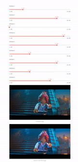

# ECCV Experiments
* `streamlit run streamlit_3_Latents.py -- --frame_index 300`

I have already stored a sample datafile in gfxdisp. Please see the requirements section below.

# color_grading_experiments

This repository lets you visualise how the image changes when we change the attributes. This is a pilot experiment where I have chosen the previously trained model.
I have devised it experiment to understand whether the idea of changing the attribute matrix changes the display image.

* `TODO`: Look into better encoding methods, by which we can actually interpret the attributes. This could be done with adding the complete image histogram alongside the neighbouring histogram.
* `TODO`: Reduce the number of attributes. Right now its 9 (for the pilot experiment). `inference_3_attributes.py` has only 3 attributes.

# Some requirements

* `Pytorch` 
* `Torchvision` 
* `Pillow`, please do `pip install pillow`  
* `Streamlit`, please do `pip install streamlit`
* `Bokeh`, please do `pip install bokeh`

You will also need to have the `lego_batman` movie yuv files:

* `../../video/lego_batman_4k/lego_batman_960x540_420_2020_10b.yuv`
* `../../video/lego_batman_hd/lego_batman_960x540_420_709_8b.yuv`

#  How to run the experiment

* `streamlit run inference.py -- --frame_index 300` 
This opens in the browser where we can use a slider to change the attributes. This run will have 9 attributes.
You can change the frame of the lego_batman movie that you need to display. The deafult takes the frame 300.

* `streamlit run inference_3_attributes.py -- --frame_index 300`
This run has 3 attributes which can be fine tuned for the desired output.

Note: You need to use -- --frame_index to parse streamlit.

At every step on changing the attribute the inference runs on the GPU. Please check whether torch.cuda.is_available() is True.

The starting point of attributes in the slider are the average values across all frames. These need not be the best values for that particular frame.

This should automatically open a new browser tab with the UI.

